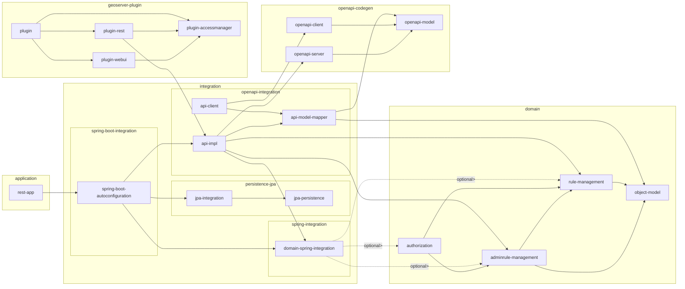

# GeoServer Access Control List (ACL)

GeoServer ACL is an advanced authorization system for [GeoServer](https://geoserver.org/).

It consists of an independent application service that manages access rules,
and a GeoServer plugin that requests authorization limits on a per-request basis.

As an administrator you'll use GeoServer ACL to define rules
that grant or deny access to published resources based on
service request properties such user credentials, the type
of OWS service, and layers being requested.

These rules can be as open as to grant or deny access
to whole GeoServer workspaces, or as granular as to specify
which geographical areas and layer attributes to allow a
specific user or user group to see.

As a user you'll perform requests to GeoServer such as WMS GetMap or WFS GetFeatures,
and the ACL-based authorization engine will limit the visibility
of the resources and contents of the responses to those matching
the rules that apply to the request properties and the authenticated
user credentials.

GeoServer ACL is not an authentication provider. It's an authorization
manager that will use the authenticated user credentials, whether
they come from Basic HTTP, OAuth2/OpenID Connect, or whatever authentication
mechanism GeoServer is using, to resolve the access rules that apply
to each particular request.

GeoServer ACL is Open Source, born as a
[fork](https://en.wikipedia.org/wiki/Fork_%28software_development%29) of 
[GeoFence](https://github.com/geoserver/geofence).
As such, it follows the same logic to define data access and administrative
access rules. So if you're familiar with GeoFence, it'll be easy to reason
about GeoServer ACL.

## Building

Requirements:

- Java 17 JDK

A Java 17 JDK is required to build the project.

The artifacts (e.g. those under [src/domain](./src/domain/README.md)
and [src/plugin](./src/plugin/README.md) ) that are part of the GeoServer plugin will still be compiled to Java 11 class compatibility.

```
./mvnw clean install
```

A [Makefile](Makefile) is also provided with useful targets for the CI build:

* `make lint`: validates source code and `pom.xml` files formatting. Used to fail the build if ill-formatted code or project configuration is pushed to github.
* `make format`: applies source code and `pom.xml` formatters, may modify files. Useful to ensure code and project configurations are properly formatted before pushing commits to github.
* `make package`: builds the projects without installing the maven artifacts to the local maven repository.
* `make test`: runs unit and integration tests.
* `make build-image`: builds a Docker image for the [GeoServer ACL application](src/artifacts/api/README.md).
* `make push-image`: pushes the Docker image to docker hub.


## Contributing

Please read the [contribution guidelines](CONTRIBUTING.md) before contributing pull requests to the GeoServer ACL project.

## Dependency graph


