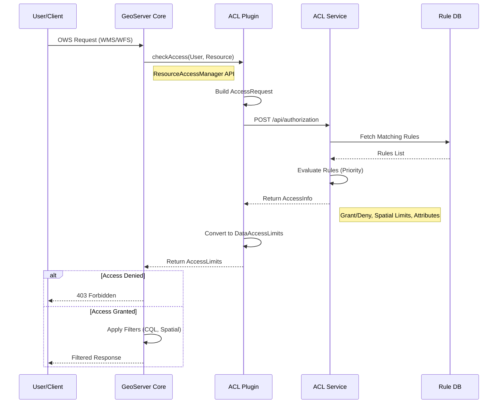

# Architecture

GeoServer ACL implements a **Hexagonal Architecture** (Ports and Adapters) to isolate core domain logic from infrastructure concerns like GeoServer internals, database persistence, and REST APIs.

## System Context

The system operates as two distinct deployment artifacts sharing a common domain kernel:

1.  **ACL Service**: A standalone Spring Boot application handling rule management and administration.
2.  **GeoServer Plugin**: An embedded interceptor running within the GeoServer process to enforce decisions.


## Module Structure

The codebase is organized to enforce architectural boundaries:

*   **`domain`**: The pure Java core. Contains business rules, entities, and *Port* interfaces. **Zero dependencies** on frameworks (Spring, Hibernate, GeoServer).
*   **`application`**: Orchestrates use cases by calling Domain services. Implements the *Application* boundary.
*   **`infrastructure`** (Integration):
    *   **`persistence`**: Implements Domain *Repository* ports using Spring Data JPA / Hibernate / PostGIS.
    *   **`web-api`**: Implements the REST API Adapter.
*   **`geoserver-plugin`**: The *Driving Adapter* that translates GeoServer internal events into ACL Domain requests.

## Core Domain Models

The Domain Layer defines the language of the system.

### Rule
The aggregate root for access control.

```java
public class Rule {
    private RuleIdentifier id;
    private int priority;
    private AccessType access; // ALLOW, DENY, LIMIT
    private String workspace;
    private String layer;
    private RuleLimits limits; // Spatial/CQL constraints
    // ... validation logic
}
```

### Authorization Service
The primary *Inbound Port* for making decisions.

```java
public interface AuthorizationService {
    /**
     * Evaluates a request against the active rule set.
     */
    AccessInfo authorize(AccessRequest request);
}
```

## Authorization Flow

1.  **Interception**: The GeoServer Plugin intercepts an OWS request (e.g., `GetMap`).
2.  **Normalization**: The plugin converts the GeoServer-specific request object into a domain `AccessRequest`.
3.  **Delegation**: The `AccessRequest` is passed to the `AuthorizationService`.
4.  **Evaluation**: The service queries the `RuleRepository` for matching rules.
5.  **Resolution**: Rules are sorted by priority; the first match dictates the `AccessInfo` result.
6.  **Enforcement**: The plugin translates `AccessInfo` back into GeoServer constructs (e.g., adding a CQL filter to the query).



## Caching Strategy

Performance is critical for per-request authorization.

1.  **Decision Cache (Caffeine)**: The `AuthorizationService` caches the computed `AccessInfo` for identical `AccessRequest` objects.
2.  **Invalidation**: Modification events (Rule create/update) are published via Spring Cloud Bus to invalidate caches across distributed instances.

## Extension Points

Developers can customize behavior by implementing specific Ports:

*   **`AuthenticationProvider`**: Default implementation uses Spring Security. Custom adapters can be written for proprietary identity providers.
*   **`RuleRepository`**: While PostGIS is the default, the interface allows swapping the storage backend (e.g., to an LDAP directory or external policy engine).
