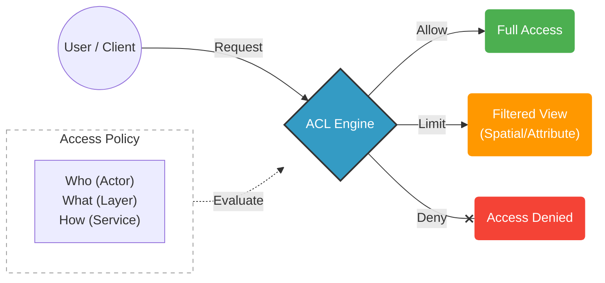

# GeoServer ACL Documentation

<!-- revisit: add actual logo
{: style="display: block; margin: 0 auto; max-width: 300px;"}
-->

## Secure Your GeoServer with Confidence

**GeoServer ACL** is an advanced, high-performance authorization system designed specifically for [GeoServer](https://geoserver.org/). It replaces the default security subsystem with a robust rule-based engine that offers fine-grained control over your geospatial data.

Whether you need to restrict access by workspace, filter data spatially, or mask sensitive attributes, GeoServer ACL provides the flexibility and performance required for enterprise-grade deployments.

### Capabilities

*   **Granular Access Control**: Define permissions at the workspace, layer, feature, and attribute levels.
*   **Spatial Security**: Restrict user access to specific geographic regions—data outside the allowed area is automatically filtered.
*   **Attribute Masking**: Hide sensitive columns (attributes) from unauthorized users while keeping the rest of the dataset visible.
*   **Service-Level Rules**: Apply different policies for WMS (viewing) versus WFS (downloading/editing).
*   **High Performance**: Built for speed with a modern architecture that minimizes overhead on your GeoServer instances.

---

## How It Works

GeoServer ACL operates as a dedicated authorization service that integrates seamlessly with your GeoServer cluster.

1.  **Administrators** define prioritized rules specifying *who* can access *what*, *where*, and *how*.
2.  **GeoServer** (via a lightweight plugin) intercepts every incoming request.
3.  The **ACL Engine** evaluates the request against your rules in milliseconds.
4.  **Access is Granted or Denied**, and data is automatically filtered to match the user's permissions.

## Project Background

GeoServer ACL originated as a fork of [GeoFence](https://github.com/geoserver/geofence). It retains the proven logic of the original project but rebuilds the underlying architecture for modern deployment needs, offering:

*   **Cloud Native Design**: Ready for Docker, Kubernetes, and microservices environments.
*   **Modern Tech Stack**: Built on Spring Boot 4 and Java 17+.
*   **Modular Architecture**: Decoupled authorization service for improved maintainability and scalability.

## Get Involved

GeoServer ACL is a community-driven project licensed under the [GPL 2.0](https://github.com/geoserver/geoserver-acl/blob/main/LICENSE). We welcome feedback, contributions, and bug reports.

*   [**GitHub Repository**](https://github.com/geoserver/geoserver-acl)
*   [**Issue Tracker**](https://github.com/geoserver/geoserver-acl/issues)
*   [**GeoServer Community**](https://geoserver.org/comm/)
