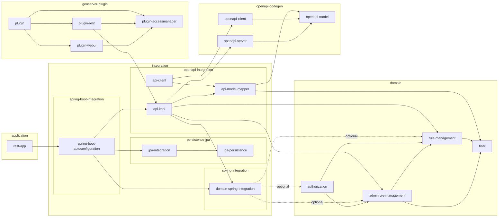

# GeoServer ACL - Source Code Architecture

> For user documentation, features, and deployment instructions, see the [main README](../README.md).

This document describes the architecture and code organization of GeoServer ACL.

## Architecture Overview

The codebase follows Clean Architecture principles, organizing code into four layers with unidirectional dependencies pointing inward:

### Layer Structure

```
                                                    ┌──────────────────────────┐
                                                    │  Integration Layer       │
                                                    │  (Inbound Adapters)      │
                                                    │                          │
┌─────────────────────────────────────┐             │  • REST API Controllers  │
│   Presentation Layer                │────────────▶│  • Spring Configuration  │
│   (artifacts/api)                   │             │                          │
│   Spring Boot application           │             └────────────┬─────────────┘
└─────────────────────────────────────┘                          │
                 │                                               │
                 ↓                                               ↓
┌─────────────────────────────────────┐             ┌──────────────────────────┐
│   Application Layer                 │◀────────────│  Integration Layer       │
│   (application/)                    │────────────▶│  (Outbound - App)        │
│                                     │             │                          │
│   • AuthorizationService            │             │  • CachingAuthorization  │
│   • Use cases                       │             │    Service (decorator)   │
│                                     │             │  • AuthorizationService  │
└─────────────────────────────────────┘             │    ClientAdaptor (REST)  │
                 │                                  └──────────────────────────┘
                 ↓
┌─────────────────────────────────────┐             ┌──────────────────────────┐
│   Domain Layer                      │◀────────────│  Integration Layer       │
│   (domain/)                         │────────────▶│  (Outbound - Domain)     │
│                                     │             │                          │
│   • Entities (Rule, AdminRule)      │             │  • JPA Repositories      │
│   • Value Objects                   │             │  • Event Publishers      │
│   • Domain Services                 │             │  • External Services     │
│   • Repository Interfaces (ports)   │             │                          │
└─────────────────────────────────────┘             └──────────────────────────┘
```

Dependencies always point inward - outer layers depend on inner layers, but never the reverse. Domain entities like `Rule` and `AdminRule` are used throughout all layers. This is intentional: they represent the core business concepts and eliminate unnecessary mapping between layers. What's prohibited is the domain layer depending on infrastructure concerns like JPA annotations, Spring framework classes, or REST API models.

The integration layer implements Hexagonal Architecture's ports and adapters pattern:
- Inbound adapters (REST controllers, Spring config) drive the application
- Application layer adapters add cross-cutting concerns like caching (`CachingAuthorizationService`) and remote access (`AuthorizationServiceClientAdaptor`)
- Domain layer adapters handle persistence (JPA repositories) and event distribution

### Domain Layer (`src/domain/`)

Core business logic with no framework dependencies:

- **gs-acl-filter**: Generic filtering framework with support for IP ranges, text matching, and special filter types (ANY, DEFAULT, specific values)

- **gs-acl-accessrules**: Rules controlling access to GeoServer resources (workspaces, layers, services). Supports ALLOW/DENY/LIMIT grants, spatial filtering, attribute-level permissions, and CQL filters

- **gs-acl-adminrules**: Simpler rules for workspace administration (ADMIN vs USER access)

Domain entities are immutable value objects built with Lombok's `@Value`, `@With`, and `@Builder`.

### Application Layer (`src/application/`)

Orchestrates business logic and implements use cases:

- **authorization-api**: Service interfaces (`AuthorizationService`) and application models (`AccessRequest`, `AccessInfo`, `AdminAccessRequest`)

- **authorization-impl**: Rule matching, evaluation, and authorization decision logic

### Integration Layer (`src/integration/`)

Implements the ports defined by inner layers:

- **persistence-jpa**: JPA repositories with MapStruct mapping between domain and JPA entities

- **openapi**: REST API generated from OpenAPI specs, with thin controller adapters

- **spring**: Spring configuration, caching, event distribution (Spring Cloud Bus), and transaction management

- **spring-boot**: Auto-configuration and dependency wiring

### Presentation Layer (`src/artifacts/`)

Runnable applications:

- **api**: Standalone Spring Boot service providing REST API for rule management and authorization

## Key Design Patterns

### Immutability

Domain objects are immutable value objects:

```java
@Value
@With
@Builder(toBuilder = true)
public class Rule {
    String id;
    long priority;
    RuleIdentifier identifier;
    RuleLimits ruleLimits;
}
```

Use `.with*()` methods to create modified copies.

### Repository Pattern

Domain layer defines repository interfaces, integration layer implements them:

```java
// Domain layer
public interface RuleRepository {
    Rule create(Rule rule);
    Optional<Rule> findById(String id);
}

// Integration layer
@Repository
class RuleRepositoryJpaAdaptor implements RuleRepository {
    // ...
}
```

### Domain Events

Services publish events for cache invalidation and remote distribution:

```java
public interface RuleAdminService {
    void setEventPublisher(Consumer<RuleEvent> eventPublisher);
}
```

### Ports and Adapters

Ports are interfaces in domain/application layers. Adapters in the integration layer implement them:
- Inbound: REST controllers, API endpoints
- Outbound: JPA repositories, cache decorators, event publishers

## Core Domain Concepts

### Rules (Data Access)

Priority-ordered rules controlling access to GeoServer resources. Lower priority numbers are evaluated first.

Match on: username, role, IP address, service type (WMS/WFS/WCS), request operation, workspace, layer

Grant types:
- **ALLOW**: Full access, optionally constrained by LayerDetails (styles, CQL filters, spatial bounds, attribute permissions)
- **DENY**: Deny access
- **LIMIT**: Grant access with RuleLimits (spatial area, catalog mode)

Spatial filtering supports CLIP or INTERSECT operations with MultiPolygon geometries. Attribute control provides column-level permissions (READONLY, READWRITE, NONE).

### AdminRules (Workspace Administration)

Simpler priority-ordered rules for workspace management:

Match on: username, role, IP address, workspace

Grant types:
- **ADMIN**: Full workspace administration
- **USER**: Regular user access

### Filters and Queries

Generic filtering framework with special semantics:
- **ANY** (`*`): Match all values
- **DEFAULT** (null): Match only catch-all rules (those with null value)
- **NAMEVALUE**: Match specific value
- **IP Ranges**: CIDR notation (e.g., `192.168.1.0/24`)

## Module Organization

### Dependency Graph



## Developer Guide

### Navigating the Codebase

Domain logic:
- Business rules: `src/domain/rule-management/` and `src/domain/adminrule-management/`
- Filtering: `src/domain/filter/`
- Authorization: `src/application/authorization-impl/`

Infrastructure:
- Database: `src/integration/persistence-jpa/`
- REST API: `src/integration/openapi/`
- Spring config: `src/integration/spring/`

Running the app:
- Entry point: `org.geoserver.acl.app.AccesControlListApplication` in `src/artifacts/api/`

### Tech Stack

- Java 17 for building, Java 25 for api runtime (latest LTS, with anticipated Project Leyden AOT optimizations)
- Spring Boot 3.5
- geolatte-geom for spatial operations
- Lombok for reducing boilerplate
- MapStruct for type-safe mapping between layers
- QueryDSL for type-safe queries
- OpenAPI code generation

### Testing

Three-tier testing approach:

**Unit tests** - Domain logic without infrastructure. Uses in-memory repositories. Example: `RuleAdminServiceImplTest`

**Integration tests** - Component interactions with real infrastructure (H2, Spring context). Example: `RuleAdminServiceJpaIT`

**E2E tests** - Full system tests with client-server communication and OpenAPI contract validation. See `openapi/java-e2e/`

### Design Notes

**Infrastructure independence** - Domain and application layers don't know about Spring, JPA, or any framework. This lets us test without infrastructure, swap persistence implementations, and upgrade frameworks without touching business logic.

**Immutability** - All domain objects are immutable (thread-safe, no defensive copying needed). Use `.with*()` methods to create modified copies.

**Event-driven** - Domain events handle cache invalidation and remote distribution for clustered deployments.

**Concurrency** - `RuleAdminServiceImpl` uses `ReentrantLock` for priority operations to prevent race conditions during rule reordering. Immutability eliminates most other concurrency issues.

### Contributing

**Dependencies:**
- Domain layer: No dependencies (keep it pure)
- Application layer: Domain + necessary utilities only (e.g., spatial libraries)
- Integration layer: Framework dependencies allowed

**Code style:**
- Use Lombok for boilerplate (`@Value`, `@With`, `@Builder`)
- Package-private by default; public only when needed
- Javadoc on public APIs

**Tests:**
- Unit tests for domain logic
- Integration tests for repositories
- Consider ArchUnit tests to enforce layer boundaries
