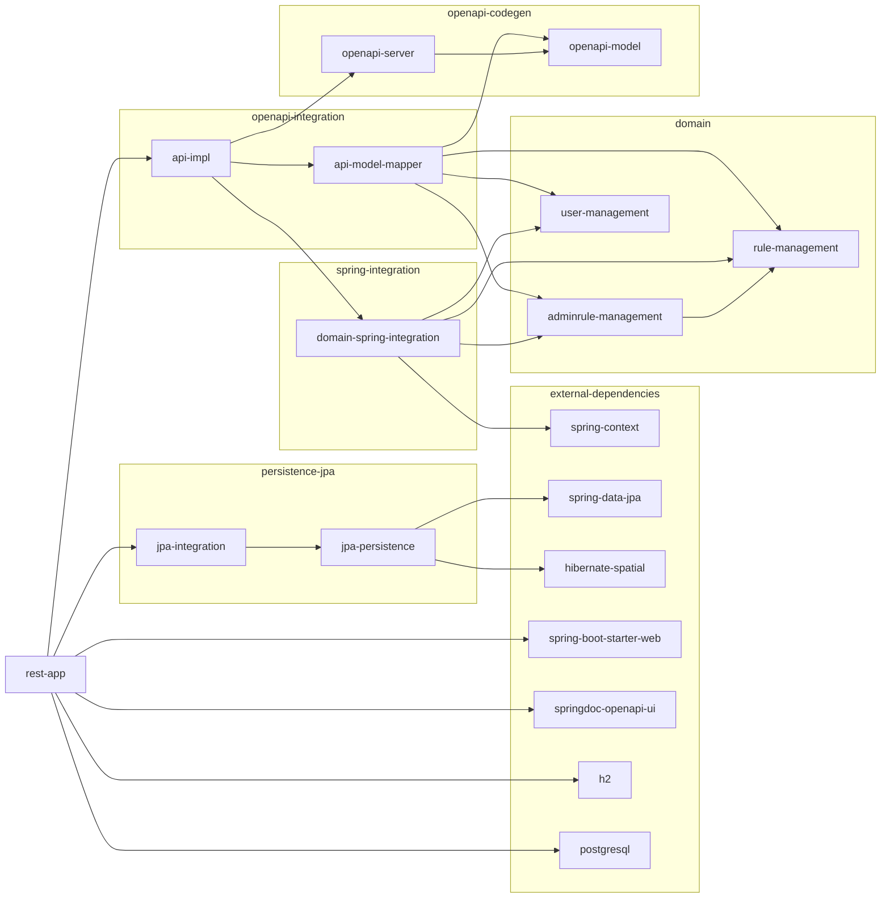

# GeoServer ACL OpenAPI Service

This is a (spring-boot) application for the GeoServer Access Control List REST API.

The OpenAPI 3 specification is available at [acl-api.yaml](../../../acl/openapi/acl-api.yaml).

With the application running at [http://localhost:8080/api](http://localhost:8080/api):

- The base URL will redirect the browser to the HTML API Swagger test page at [http://localhost:8080/api/v2/swagger-ui/index.html](http://localhost:8080/api/v2/swagger-ui/index.html).
- The OpenAPI spec is exposed in JSON format at [http://localhost:8080/api/v2/api-docs](http://localhost:8080/api/v2/api-docs)


## Build

```
mvn clean install
```

will create a single-jar executable at `target/gs-cloud-acl-service-<version>-bin.jar`.

## Run


Run in development mode with an in-memory H2 database, either with

	mvn spring-boot:run -Dspring-boot.run.profiles=dev

or

	java -jar target/gs-cloud-acl-service-1.0-SNAPSHOT-bin.jar --spring.profiles.active=dev


## Dependency graph


