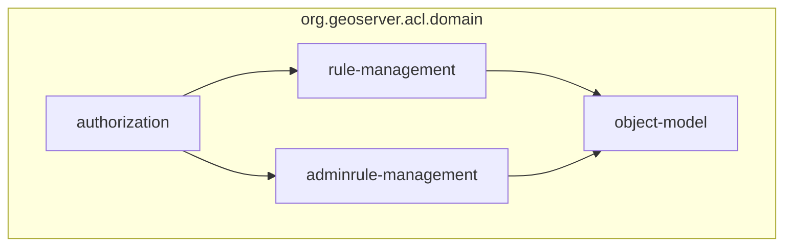
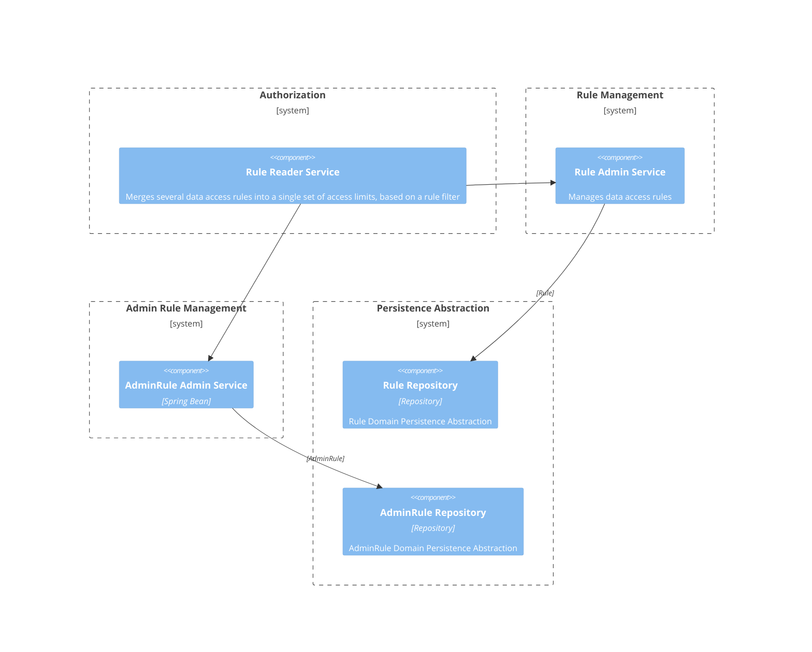

# GeoServer ACL Domain Business Model

## Dependency graph

```mermaid
flowchart LR
  subgraph org.geoserver.acl.domain
    direction LR
    rule-management --> object-model
    adminrule-management --> object-model
    authorization --> rule-management & adminrule-management
  end
```

## Component diagram

```mermaid
C4Context
  Boundary(authb, "Authorization") {
    Component(ruleAcces, "Rule Reader Service", "", "Merges several data access rules into a single set of access limits, based on a rule filter",)
    
    Rel_R(ruleAcces, adminRule, "")
    Rel_R(ruleAcces, rule, "")
  }
  Boundary(rmb, "Rule Management") {
    Component(rule, "Rule Admin Service", "", "Manages data access rules")      
    Rel_R(rule, ruleRepo, "", "Rule")
  }
  Boundary(armb, "Admin Rule Management") {
    Component(adminRule, "AdminRule Admin Service", "Spring Bean")
    Rel_R(adminRule, adminRuleRepo, "", "AdminRule")
  }
  Boundary(repos, "Persistence Abstraction") {
    Component(ruleRepo, "Rule Repository", "Repository", "Rule Domain Persistence Abstraction")
    Component(adminRuleRepo, "AdminRule Repository", "Repository", "AdminRule Domain Persistence Abstraction")
  }
```
